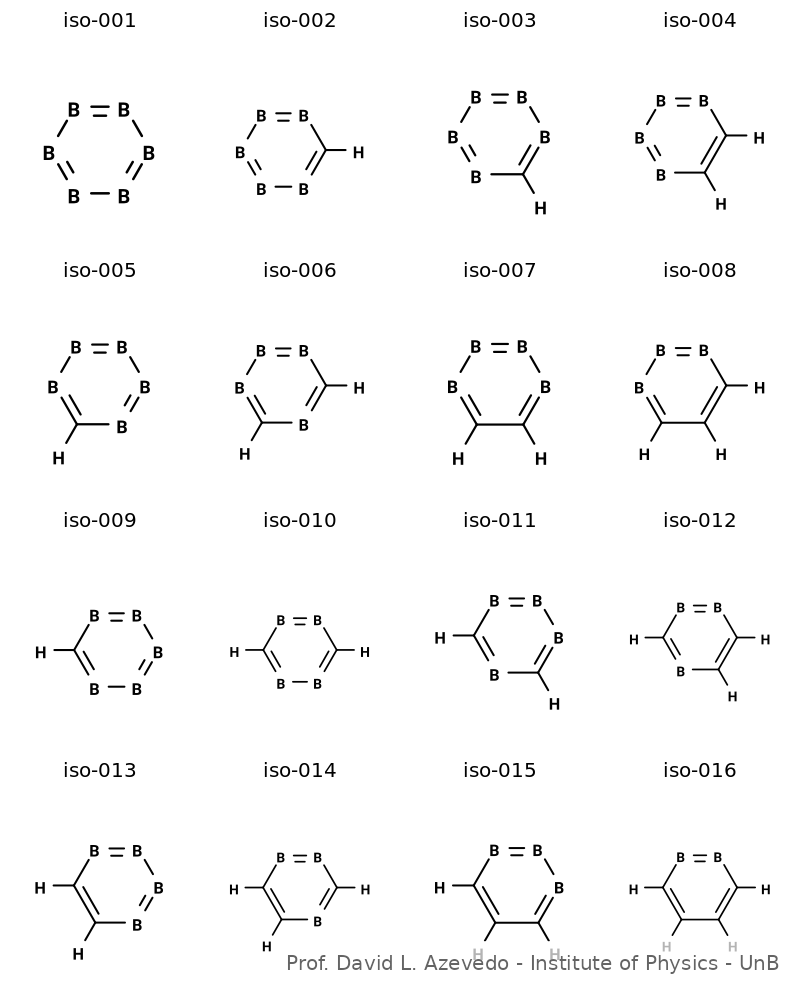
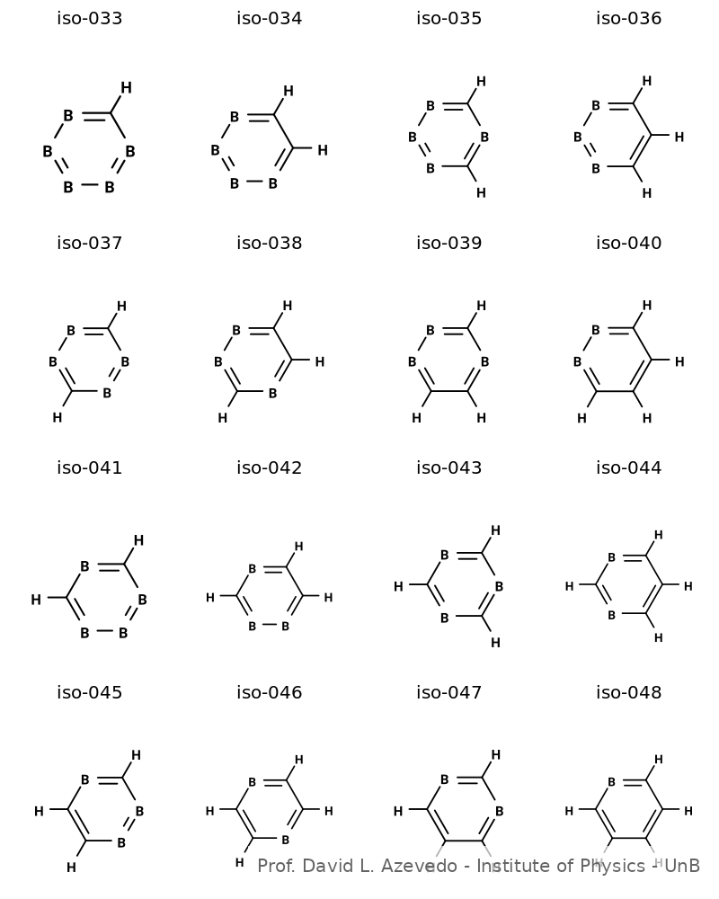
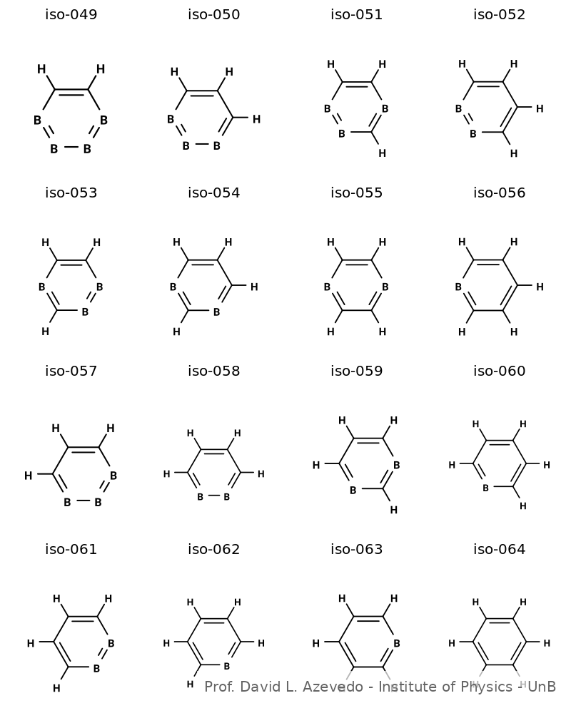
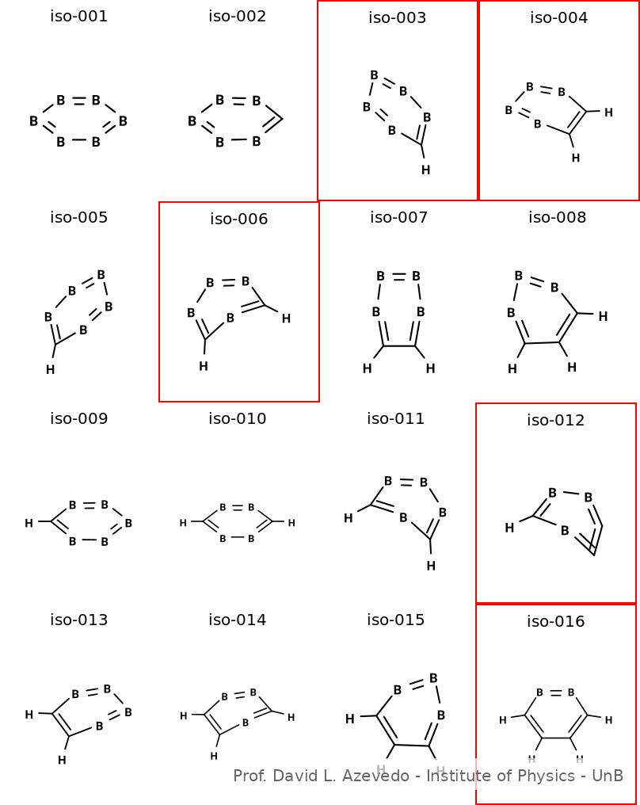

# Novel Cyclic B<sub>x</sub>C<sub>y</sub>H<sub>z</sub> Nanorings
## First-principles Design and Electronic Tunability of Boron-Carbon Hybrid Nanostructures

[](https://www.journals.elsevier.com/computational-materials-science)
[](https://www.journals.elsevier.com/computational-materials-science)

**Article Status:** Under Review at *Computational Materials Science*

---

## Authors

**Ketlen Brenda de O. Rodrigues**†  
Institute of Physics, University of Brasília (UnB), Brazil  
📧 ketlen.rodrigues@aluno.unb.br

**Isaac M. Virgilio**†  
Institute of Physics, University of Brasília (UnB), Brazil  
📧 isaac.virgilio@aluno.unb.br

**David L. Azevedo***  
Institute of Physics, University of Brasília (UnB), Brazil  
📧 david888azv@unb.br

<sup>†</sup>*Equal contribution*  |  <sup>*</sup>*Corresponding author*

**Affiliation:**  
Institute of Physics, University of Brasília  
Campus Darcy Ribeiro, 70919-970, Brasília, DF, Brazil

---

## Abstract

This study presents a systematic investigation of cyclic boron-carbon-hydrogen (B<sub>x</sub>C<sub>y</sub>H<sub>z</sub>) nanorings using density functional theory (DFT). We explored **64 distinct isomers** satisfying the stoichiometric constraint x + y = 6, identifying **12 energetically favorable structures** with exceptional stability and tunable properties.

**Key Results:**
- **Binding energies:** -0.493 to -0.267 eV/atom
- **Electronic band gaps:** 0.761-6.238 eV (HSE06), spanning semiconductors to wide-gap insulators
- **Thermal stability:** Confirmed across 298-1000 K, indicating feasible room-temperature synthesis
- **Optical absorption:** UV-C to near-infrared (173-1527 nm)

Vibrational analysis (HSE06 functional) confirmed dynamical stability for 56 structures. The remarkable electronic and optical tunability through compositional variations positions these nanorings as promising candidates for molecular electronics, optoelectronics, and sensing applications.

**Methods:** DFT calculations using GGA-PBE (optimization) and HSE06 (electronic refinement) functionals implemented in BIOVIA Materials Studio and ORCA.

---

## Structures Gallery

### Non-Optimized Isomers (Initial Geometries)

<p align="center">


</p>

<p align="center">


</p>

**Figures:** ISO-001 to ISO-064 (initial geometries before DFT optimization)

### Optimized Isomers (DFT-Refined Geometries)

<p align="center">


</p>

<p align="center">


</p>

**Figures:** ISO-001 to ISO-064 (DFT-optimized geometries, stable isomers highlighted with red borders)

**Color Code:** 🔴 Boron | ⚫ Carbon | ⚪ Hydrogen

---

## Download Structures

### 📦 Non-Optimized Structures
**[Download b3c3-isomers-non-optimized.zip](./structures/b3c3-isomers-non-optimized.zip)**
- 64 initial isomer geometries
- MOL format (MDL Molfile)
- Compatible with VMD, Avogadro, Jmol, PyMOL, GaussView

### 📦 Optimized Structures  
**[Download b3c3-isomers-optimized.zip](./structures/b3c3-isomers-optimized.zip)**
- 56 DFT-optimized geometries (GGA-PBE level)
- Only dynamically stable structures (positive vibrational frequencies)
- MOL format (MDL Molfile)

---

## Citation

If you use these structures in your research, please cite:

```bibtex
@article{Rodrigues2025,
  title={Novel cyclic B$_x$C$_y$H$_z$ nanorings: First-principles design and 
         electronic tunability of unexplored boron-carbon hybrid nanostructures},
  author={Rodrigues, Ketlen B. O. and Virgilio, Isaac M. and Azevedo, David L.},
  journal={Computational Materials Science},
  year={2025},
  note={Under Review}
}
```

---

## Acknowledgments

This work was supported by:

- **FAP-DF** (Distrito Federal Research Foundation) - Grants 04/2017 and 09/2022
- **CNPq** (National Council for Scientific and Technological Development) - Research productivity fellowship (Proc. 306456/2025-7)
- **University of Brasília (UnB)** - Institutional support and scholarships (ProIC)
- **CAPES** (Coordination for the Improvement of Higher Education Personnel)
- **FAPEMAT** (Mato Grosso Research Foundation) - PRONEX CNPq/FAPEMAT Grant 850109/2009

This work used resources of the **Centro Nacional de Processamento de Alto Desempenho em São Paulo (CENAPAD-SP)**.

### Funding Agencies

<p align="center">
&nbsp;&nbsp;&nbsp;&nbsp;
&nbsp;&nbsp;&nbsp;&nbsp;
&nbsp;&nbsp;&nbsp;&nbsp;

</p>

---

## Contact

**Dr. David L. Azevedo**  
📧 david888azv@unb.br  
🏛️ Institute of Physics, University of Brasília (UnB)

---

## License

[](https://creativecommons.org/licenses/by/4.0/)

This work is licensed under [Creative Commons Attribution 4.0 International License](https://creativecommons.org/licenses/by/4.0/).

---

<div align="center">

**Computational Materials Science Research**  
*Institute of Physics, University of Brasília*

</div>
